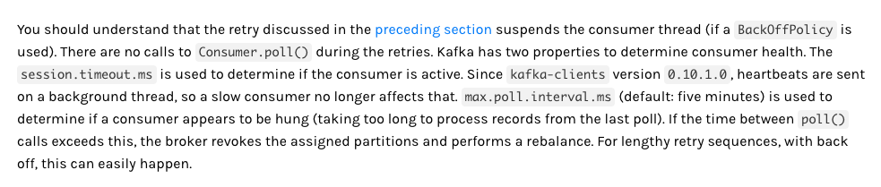
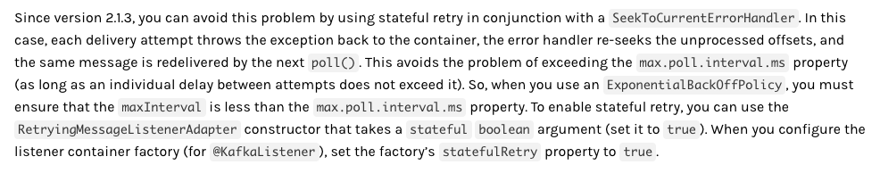
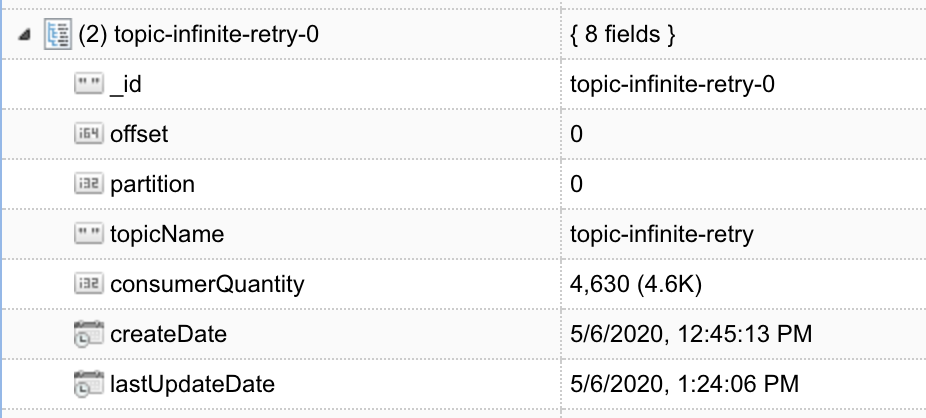

## Spring Kafka Consumer Infinite Retry
Objetivo deste projeto é demonstrar uma configuração de retentativa de consumo de mensagens que não viola os limites de session e max poll do broker. 

### Documentation Notes
O trecho abaixo da documentação do Spring Kafka explica as consequências de usar o BackOffPolicy como política de retentativa


O trecho abaixo da documentação do Spring explica como resolver o problema acima usando a feature Stateful Retry


### Example

O trecho de código abaixo demonstra uma das formas de configurar o Stateful Retry com intervalos de retentiva de 5 segundos e o máximo de tentativas "infinito" (Long.MAX_VALUE)

```
@Configuration
@EnableKafka
public class KafkaConfiguration {

  @Autowired private KafkaProperties kafkaProperties;

  @Bean
  @Primary
  public KafkaListenerContainerFactory<ConcurrentMessageListenerContainer<String, String>>
      kafkaListenerContainerFactory() {
    ConcurrentKafkaListenerContainerFactory<String, String> factory =
        new ConcurrentKafkaListenerContainerFactory<>();
    factory.setConcurrency(kafkaProperties.getListener().getConcurrency());
    factory.setConsumerFactory(
        new DefaultKafkaConsumerFactory<>(kafkaProperties.buildConsumerProperties()));
    factory.getContainerProperties().setAckMode(AckMode.RECORD);
    factory.setErrorHandler(
        new SeekToCurrentErrorHandler(
            new FixedBackOff(FixedBackOff.DEFAULT_INTERVAL, FixedBackOff.UNLIMITED_ATTEMPTS))); //DEFAULT_INTERVAL == 5 seconds, UNLIMITED_ATTEMPTS == Long.MAX_VALUE
    factory.setStatefulRetry(true);
    return factory;
  }
}
```

### Project Usage

#### Sending a message
O curl abaixo produz uma nova mensagem e retorna o offset gerado

```
curl -X POST "http://localhost:8080/api/v1/messages" -H "accept: application/json"
```

#### Checking database
Através da collection consumerTrace é possível ver a quantidade de vezes que o mesmo offset foi consumido. 
Nesse exemplo foram 4630 vezes que o mesmo offset passou pelo consumer no intervalo de aproximadamente 1h30.




### Reference Documentation

* [Spring Kafka Retrying Deliveries documentation](https://docs.spring.io/spring-kafka/docs/2.3.8.RELEASE/reference/html/#retrying-deliveries)
* [Spring Kafka Stateful Retry documentation](https://docs.spring.io/spring-kafka/docs/2.3.8.RELEASE/reference/html/#stateful-retry)


